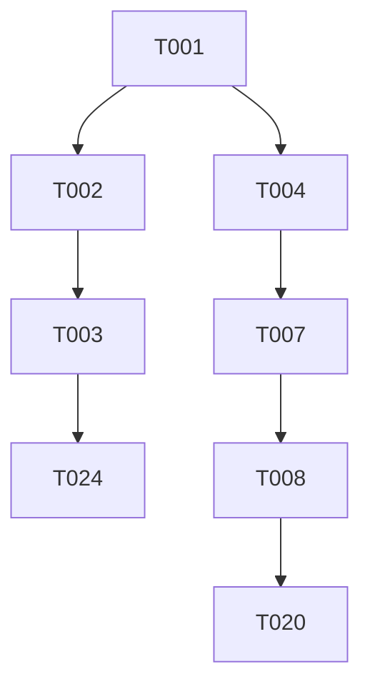

# Implementation Tasks: Agentic AI Book

**Feature**: `1-agentic-ai-book` | **Spec**: [Link](./spec.md) | **Plan**: [Link](./plan.md)

## Phase 1: Setup
*Goal: Initialize the project and install dependencies*

- [x] T001 Initialize Docusaurus 3 project (clean install) in `.`
- [x] T002 Install math dependencies (`remark-math`, `rehype-katex`) in `package.json`
- [x] T003 Configure `docusaurus.config.js` with math plugins and stylesheet in `docusaurus.config.js`
- [x] T004 Clean up default content (delete default `docs/*`, `blog/`) in `docs/`

## Phase 2: Foundational
*Goal: Base layout and prerequisites*

- [x] T005 Create basic landing page `src/pages/index.js`
- [x] T006 Create empty or scaffolded sidebar structure in `sidebars.js`

## Phase 3: Structured 12-Week Learning Journey
*Goal: Implement the core curriculum content and navigation (User Story 1)*

**Independent Test**: Verify the sidebar matches the 12-week structure exactly and navigation follows the chronological order.

- [x] T007 [US1] Create `docs/intro.md` with book description
- [x] T008 [P] [US1] Create `docs/week-01-anatomy.md` (Anatomy of an Agent)
- [x] T009 [P] [US1] Create `docs/week-02-language.md` (The Power of Language)
- [x] T010 [P] [US1] Create `docs/week-03-reasoning.md` (Reasoning Patterns)
- [x] T011 [P] [US1] Create `docs/week-04-tool-use.md` (Tool Use)
- [x] T012 [P] [US1] Create `docs/week-05-react.md` (The ReAct Framework)
- [x] T013 [P] [US1] Create `docs/week-06-rag.md` (External Knowledge)
- [x] T014 [P] [US1] Create `docs/week-07-planning.md` (Planning and Decomposition)
- [x] T015 [P] [US1] Create `docs/week-08-memory.md` (Memory Systems)
- [x] T016 [P] [US1] Create `docs/week-09-orchestration.md` (Multi-Agent Orchestration)
- [x] T017 [P] [US1] Create `docs/week-10-errors.md` (Error Handling)
- [x] T018 [P] [US1] Create `docs/week-11-ethics.md` (The Ethics of Autonomy)
- [x] T019 [P] [US1] Create `docs/week-12-capstone.md` (Building the Capstone)
- [x] T020 [US1] Configure `sidebars.js` with correct Phase grouping (I, II, III, IV) in `sidebars.js`
- [x] T021 [US1] Allow manual verification of site build in `package.json`

## Phase 4: Clean Environment
*Goal: Ensure project hygiene (User Story 2)*

**Independent Test**: Inspect file structure to confirm absence of generic templates.

- [x] T022 [US2] Audit file structure to remove any remaining generic templates in `README.md`
- [x] T023 [US2] Ensure `blog/` is removed or disabled in `docusaurus.config.js`

## Final Phase: Polish
*Goal: Final checks*

- [x] T024 Verify math rendering on a sample page in `docs/week-01-anatomy.md`
- [x] T025 Check search functionality in `docusaurus.config.js`

## Dependencies

## Implementation Strategy

1. **MVP**: Complete Phase 1 and T007-T008 + T020 to prove structure.
2. **Parallel**: Tasks T008-T019 can be implemented in parallel by specifying the exact content layout from `data-model.md`.
3. **Verification**: Run `npm run build` after each phase.
